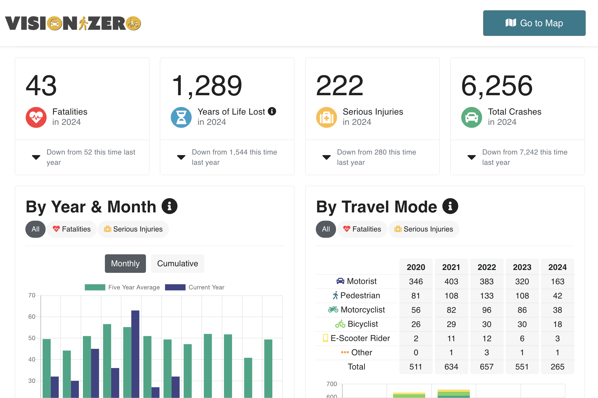

# Vision Zero Crash Data System



The Vision Zero Crash Data System is a suite of tools which support the City of Austin's [Vision Zero program](https://www.austintexas.gov/department/vision-zero), which seeks to reduce people hurt or killed by traffic crashes in Austin, TX.

The system has a primary focus on storing, editing, and analyzing traffic crash data, and comprises these core components:

- [Vision Zero Database](./database/README.md) (VZD): A postgresql database which stores crash and crash-related records
- [Vision Zero Editor](./editor/README.md) (VZE): A web application which enables City staff to browse and edit crash data
- [Vision Zero Viewer](./viewer/README.md) (VZV): A public-facing dashboard which provides key metrics and insights about crash injuries and fatalities

This repository also holds integration scripts for consuming crash data from external sources, as well as publishing crash data to the City's Open Data Portal.

## Table of contents

- [Quick start](#quick-start)
- [Learn more](#learn-more)
- [License](#license)

## Quick start

You need access to the production VZ database in order to develop locally. There is currently no option to run the Vision Zero stack based on seed data.

The helper script, `vision-zero`, makes it easy to spin up the database and API. See the [local development docs](docs/local_dev.md) for more details.

1. Create a new Python environment and install the packages in [requirements.txt](requirements.txt).

```shell
# Example for Mac
python -m venv venv
source venv/bin/activate
pip install -r requirements.txt
```

2. Save a copy of the [environment template (`env_template`)](env_template) as `.env`, and populate your database read replica credentials.

```shell
RR_USERNAME=""
RR_PASSWORD=""
RR_HOSTNAME=""
RR_DATABASE=""
```

3. Start the DB + GraphQL API. You'll need to be on City of Austin VPN _or_ your IP address will need to be whitelisted to reach our read-replica host.

```shell
./vision-zero replicate-db
```

This command will:

- Download a snapshot of the production database
- Store the file in `./database/snapshots/visionzero-{date}-{with|without}-change-log.sql
- Drop local `vision_zero` database
- Create and repopulate the database from the snapshot

Note: the `-f / --filename` flag can be optionally used to point to a specific data dump `.sql` file to use to restore. The way the snapshots are dated means that one will only end up downloading one copy of the data per-day, both with and without change log data.

See [here](docs/local_dev.md) for in-depth documentation about the `vision-zero` helper.

4. Configure the Vision Zero editor. Navigate to the `/editor` subdirectory and create a file called `.env.local`, and save the contents of the 1Password item called **Vision Zero Editor (VZE) Environment File** into this file.

5. Activate your Node environment - requires [`nvm`](https://github.com/nvm-sh/nvm).

```shell
nvm use
```

6. Install required package

```shell
npm install
```

7. Finally, start the app - visit [http://localhost:3002](http://localhost:3002) with your browser to see the result

```
npm run dev
```

8. Visit the individual subdirectory READMEs to find instructions for starting other parts of the app, such as the user management API and the Vision Zero Viewer.

## Learn more

- [Vision Zero Database (VZD)](./database/README.md) - the database that powers the Vision Zero suite
- [Vision Zero Editor (VZE)](./editor/README.md) - web application which enables City staff to browse and edit crash data
- [Vision Zero Viewer (VZV)](./viewer/README.md) - public dashboard which provides key metrics and insights about
- [api](./api/README.md) - our API that securely downloads a private file from S3
- [etl](./etl/README.md) - integration scripts for bringing data in the Vision Zero Database
- [toolbox](./toolbox/README.md) - collection of utilities and scripts designed for ad-hoc maintenance tasks

## License

As a work of the City of Austin, this project is in the public domain within the United States.

Additionally, we waive copyright and related rights of the work worldwide through the [CC0 1.0 Universal public domain dedication](https://creativecommons.org/publicdomain/zero/1.0/).
