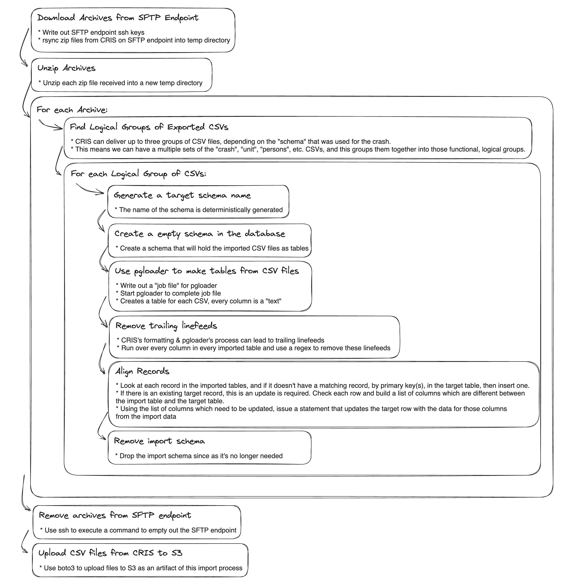

## Import script for CRIS zip file extracts

The contents of this directory define a Docker image that can be used in an Airflow DAG to download and process the zip archives that are delivered to us by CRIS to our SFTP endpoint.

### Diagram of process flow




## Development Tooling

### Zip file acquisition

The CRIS import usually works by pulling down a zip archive from the SFTP endpoint. However, during development, it's much easier if you can have it use a zip file that you have locally on your machine instead. This can be accomplished by putting a zip file (still encrypted and using "CRIS extract" password) in a folder named `atd-etl/cris_import/development_extracts/`. Create the directory if needed. If there are no zip files in that folder, the program will automatically revert to inspecting the SFTP endpoint.

### Local testing

Make a copy of `env-template` and name it `env`. Fill in the values using the 1Password Connect Server secrets (see entries titled `Endpoint for 1Password Connect Server API` and `Vault ID of API Accessible Secrets vault`) and your personal access token.

Drop a CRIS extract zip file into your development folder as described above, and run the import script:
```bash
docker compose run cris-import
```
