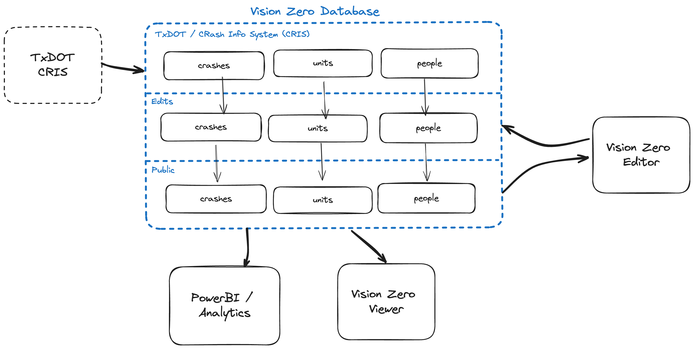

# Vision Zero Database (VZD)

The Vision Zero Database (VZD) is a Postgresql database that serves as the central repository Austin's traffic crash data. The database is fronted with a GraphQL API, powered by [Hasura](https://github.com/hasura/graphql-engine), which is also used to manage schema migrations. 

The database is designed supports a sophisticated editing environment which enables Vision Zero program staff to edit and enrich crash data, while also allowing record updates to flow into the database from upstream sources, such as the TxDOT Crash Information System.


## Data sources

### TxDOT Crash Records Information System (CRIS)

The [TxDOT Crash Record Information System](https://www.txdot.gov/data-maps/crash-reports-records/crash-data-analysis-statistics.html), CRIS, is a statewide, automated database for traffic crashes reports.

CRIS data accounts for the vast majority of records in the database; the [Vision Zero Editor (VZE)](../atd-vze/README.md) is designed primarily as a tool for editing and enriching data received from CRIS, and the [Vision Zero Viewer (VZV)](../atd-vzv/README.md) is powered entirely by enriched CRIS data.

#### Design

The core challenge that the Vision Zero database solves is to store CRIS data in a central repository where it can be reviewed and updated City of Austin staff. The database preserves the integrity of staff members' edits while simultaneously allowing crash record updates flow into the database from CRIS.



#### CRIS data processing

### Austin Fire Department (AFD) and Travis County Emergency Medical Services (EMS)

### Geospatial layers

## Common maintenance tasks

### Add a new CRIS-managed column to the database

### Add a custom column to the database

### Add a custom lookup value to the database

## Backups

RDS

## Hasura

We deployed a standard Hasura container to work as an API between Postgres and atd-vze. For more information on how it works, please refer to their [website](https://hasura.io) and documentation.

## Pipeline

Changes to the schema and database are handled by CI (GitHub Action workflow) that applies migrations and metadata using the [Hasura CLI](https://hasura.io/docs/latest/hasura-cli/overview/).

### Generating migrations and metadata changes

- Merge the latest code from the `master` branch into your feature branch to make sure you have the latest migrations that are applied to the staging database
- Start up the local database and Hasura engine and replicate using the latest production data dump
- To make sure your local database is up to date with the current changes in `master` branch, run:

```bash
hasura migrate apply --envfile .env.local
hasura metadata apply --envfile .env.local
```

- Start the local Hasura console and make any changes needed which will then reflect in your project folder

### Merging an approved feature branch

We need to check the order of migrations against those in the `master` branch **before merging a feature branch** so that we can make updates to the migration version order if needed. The version refers to the timestamp in the migration folder name.

To check migrations for any conflicts with the latest migrations in the `master` branch:

- Make sure that your branch is up to date with `master`
- Check to make sure no one else is actively merging their work and coordinate if needed
- Update the migration versions in your branch so they are the newest migrations if needed
- Start up the local database and Hasura engine and replicate using the latest production data dump
- Then, run:

```bash
hasura migrate apply --envfile .env.local
hasura metadata apply --envfile .env.local
```

Once we see that no errors occur when applying the sequence of migrations locally, we can merge and the CI will apply the new migrations and metadata to the staging database.

<!-- Production site: http://vzd.austinmobility.io/ -->
<!-- Staging site: https://vzd-staging.austinmobility.io/ -->
