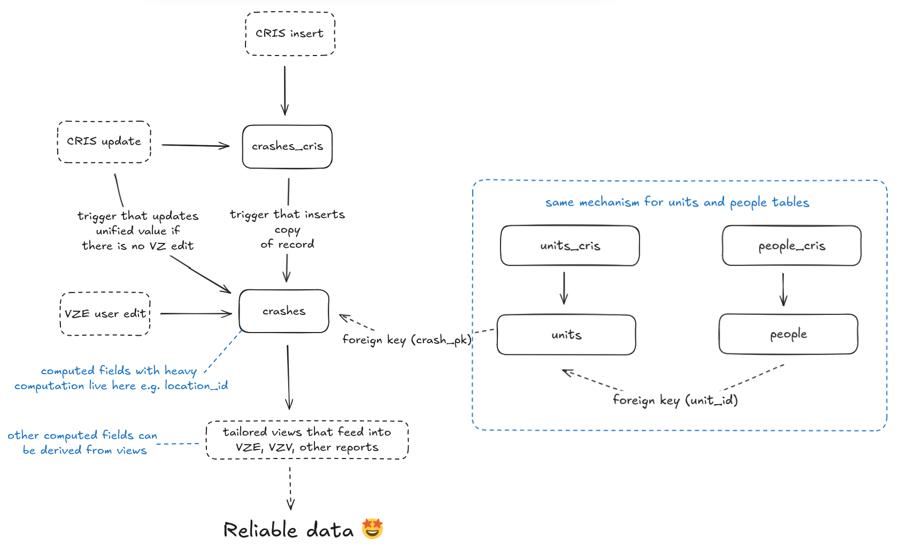

# Vision Zero Database (VZD)

The Vision Zero Database (VZD) is a Postgresql database that serves as the central repository of Austin's traffic crash data. The database is fronted with a GraphQL API, powered by [Hasura](https://github.com/hasura/graphql-engine), which is also used to manage schema migrations.

The design supports an editing environment which enables Vision Zero program staff to edit and enrich crash data, while also allowing record updates to flow into the database from upstream sources, such as the TxDOT Crash Records Information System (CRIS) and local emegency medical services.


- [Data sources](#data-sources)
  - [TxDOT Crash Records Information System (CRIS)](#txdot-crash-records-information-system-cris)
    - [Design](#design)
    - [CRIS Extract configuration and accounts](#cris-extract-configuration-and-accounts)
    - [CRIS data processing](#cris-data-processing)
    - [Lookup tables](#lookup-tables)
      - [Lookup table structure and custom lookup table values](#lookup-table-structure-and-custom-lookup-table-values)
    - [Charges records](#charges-records)
    - [Database IDs, CRIS record IDs, and primary keys](#database-ids-cris-record-ids-and-primary-keys)
    - [User-created crash records, aka "temporary" records](#user-created-crash-records-aka-temporary-records)
    - [Audit fields](#audit-fields)
    - [Change logs](#change-logs)
  - [Austin-Travis County Emergency Medical Services (EMS)](#austin-travis-county-emergency-medical-services-ems)
  - [Austin Fire Department (AFD)](#austin-fire-department-afd)
  - [Geospatial layers](#geospatial-layers)
- [Common maintenance tasks](#common-maintenance-tasks)
  - [Add a new CRIS-managed column to `crashes`, `units`, or `people`](#add-a-new-cris-managed-column-to-crashes-units-or-people)
  - [Add a custom column to `crashes`, `units`, or `people`](#add-a-custom-column-to-crashes-units-or-people)
  - [Adding a computed or generated field to `crashes`, `units`, or `people`](#adding-a-computed-or-generated-field-to-crashes-units-or-people)
  - [Refresh lookup tables with the latest CRIS values](#refresh-lookup-tables-with-the-latest-cris-values)
  - [Add a custom lookup value to a CRIS-managed lookup table (todo)](#add-a-custom-lookup-value-to-a-cris-managed-lookup-table-todo)
  - [Debugging record triggers](#debugging-record-triggers)
  - [Parsing change log data](#parsing-change-log-data)
  - [Creating a new geospatial layer](#creating-a-new-geospatial-layer)
- [Backups](#backups)
- [Hasura](#hasura)
- [Development and deployment](#development-and-deployment)
  - [Generating migrations and metadata changes](#generating-migrations-and-metadata-changes)
  - [Merging an approved feature branch](#merging-an-approved-feature-branch)

## Data sources

### TxDOT Crash Records Information System (CRIS)

The [TxDOT Crash Record Information System](https://www.txdot.gov/data-maps/crash-reports-records/crash-data-analysis-statistics.html) (CRIS) is a statewide, automated database for traffic crashes reports.

CRIS data accounts for the vast majority of records in the database: the [Vision Zero Editor (VZE)](../editor/README.md) is designed primarily as a tool for editing and enriching data received from CRIS, and the [Vision Zero Viewer (VZV)](../viewer/README.md) is powered entirely by enriched CRIS data.

The CRIS data in our database consists of four record types:

- `crashes` - each row is single crash event, with attributes such as the crash timestamp, crash location, and manner of collision
- `units` - each row describes a unit, or vehicle, involved in a crash. Each unit relates to one crash record.
- `people` - each row describes a person involved in a crash. Each person relates to one unit.
- `charges` - each row describes a legal charge filed by the responding law enforcement agency. Each charge relates to one person. Charges have special handling and only exist in the `charges_cris`, as described in detail [below](#charges-records).

#### Design

The core challenge that the database schema solves is to preserve the integrity of staff members' edits while simultaneously allowing crash record updates to flow into the database from CRIS. The editing environment is achieved by managing two copies of each of the `crashes`, `units`, and `people` tables, so that CRIS edits can have their own table and thus be isolated from Vision Zero staff edits.

For example, the `crashes` records are managed in two tables:

- `crashes_cris`: records that are created and updated by TxDOT CRIS through the [CRIS import ETL](../etl/cris_import/README.md)
- `crashes`: a unified version of each record which combines the values in `crashes_cris` plus any edits created by Vision zero staff through the Vision Zero Editor web app. This table functions as the final source of truth, where user edits take precedence over CRIS values.

As pictured in the diagram below, the typical data flow for a crash record is as follows:

1. A new record is inserted into the `crashes_cris` table through the [CRIS import ETL](../etl/cris_import/README.md).
2. On insert into `crashes_cris`, a complete copy of the record is inserted into the `crashes` table.
3. A Vision Zero Editor user may update crash records by updating rows in the `crashes` table.
4. When an existing `crashes_cris` record is updated through the CRIS import ETL, a trigger function compares the old value in the `crashes_cris` table to the value in the unified `crashes` table and if they are the same, meaning there have been no user edits, the `crashes` value is also updated with the new value. If there has been a user edit, the updates to the `crashes_cris` table do not propagate to the `crashes` table.
5. Once a record is updated in the `crashes` table, additional trigger functions apply various business rules and enrich the row with spatial attributes based on its location. These trigger functions are reserved for values that require heavy computation—additional business rules can be applied through table views.


_The "layered" editing environment of the Vision Zero Database_

The process for updating `units` and `people` behaves in the same manner as `crashes`. To ensure proper data flow and trigger behavior, **records should never be directly inserted into the unified tables**.

#### CRIS Extract configuration and accounts

The team maintains multiple CRIS login accounts to manage the delivery of CRIS data to our AWS S3 ingest bucket. See the [CRIS import ETL documentation](../etl/cris_import/README.md) for more information on how CRIS data is delivered to S3 and imported into our database.

The credentials for our CRIS logins are in the password store, including a note in the title indicating each login's purpose:

- **Production extract account**: this is the account which is configured for daily delivery of extracts to S3 production.
- **Dev/testing extract account**: this account should be used for requesting ad-hoc CRIS extracts for delivery via S3 or manual download.
- **Query & analyze account**: this account can be used for the CRIS query interface, that enables querying and access to individual crash records.

Additional information about CRIS access can be found on the [TxDOT website](https://www.txdot.gov/data-maps/crash-reports-records/crash-data-analysis-statistics.html). [This TxDOT guide](https://www.txdot.gov/content/dam/docs/crash-records/cris-guide.pdf) also provides an overview of how CRIS data delivery is configured.

##### Extract delivery configuration

CRIS can be configured to deliver files to an AWS S3 bucket. This configuration only needs to be established once, and then it can be re-used whenever an extract file is requested.

You will need to follow these steps to create or update our delivery configuration, which would be necessary if we were using a new/re-activated CRIS user account, our S3 bucket structure changed, etc.

1. Login to CRIS using the appropriate account (see above): https://cris.dot.state.tx.us/
2. Use the account dropdown menu in the top-right corner of the screen and select **Delivery Options**


1. Select `AWS` as the delivery method and fill in the config form as pictured below. See the **CRIS Import** item in 1pass for the current credentials.

2. Note that the **Key Name Prefix** must not begin with a slash: `prod/cris_extracts/inbox/`

3. You can test the configuration by clicking the **Test AWS Connection** button. Although, this will test if the AWS credentials are valid, it will not detect an issue with the **Key Name Prefix**. An invalid **Key Name Prefix** will not result in any error on the CRIS website.


4. Click **Save** to save your config

##### Extract file configutration

Follow these steps to configure a new extract delivery:

1. Login to CRIS using the appropriate account (see above): https://cris.dot.state.tx.us/

2. From the **My Extract Requests** page, click **Add**, and follow the extract request wizard

- **Extract Type**: Standard
- **Extract Format**: CSV
- **Include CR-3 Crash Report files in Extract**: Yes (checked)


- **Include Crash Reports From**: Specific Counties: `Hays`, `Travis`, and `Williamson`

- **Include Crash Reports From**: Process Date range
  - If you are backfilling, include a day before your target day as a buffer.
  - If you request a process date of today, the extract will not deliver until the next day.
  - To set up a recurring request, add a range of dates that ends in the future.

Any part of the range that falls in the past will be delivered in single zip that is separate from the zips that will deliver in the future. The includes - all records with process dates available including today.

Any part of the range that is in the future will create daily zips that include each day available going forward. For example, on 4/19/2024, you make a request for Process Begin Date = 01/01/2024 and Process End Date = 12/31/2024 The would receive two zips: One containing all records with process date from 01/01/2024 to 04/18/2024, and one containing all records with process date from 04/19/2024 to 04/19/2024. Going forward, you will receive one zip per day for each process date that passes

- **Extract password**: the password called `EXTRACT_PASSWORD` from Vision Zero CRIS Import 1Password item
- **Delivery**: How you want to receive it. Typically you would use the pre-configured AWS option, specifiyng the `dev`, `staging`, or `prod` inbox subdirectory. See the CRIS import ETL readme for more details.

#### CRIS data processing

We receive CRIS data from TxDOT on a nightly basis through the CRIS "automated interface", which delivers an encrypted `.zip` file to an S3 bucket on our AWS premise. The `.zip` file contains all crash records _processed_ in the last 24 hours, and includes both CSV files and crash report PDFs (aka CR3s).

See [our docs](#cris-extract-configuration-and-accounts) about the extract configuration for more details.

For more details on how we ingest CRIS data into our database, see the [CRIS import ETL documentation](../etl/cris_import/README.md).

#### Lookup tables

Lookup tables for `crashes`, `units`, and `people` tables are housed in the `lookups` schema in the database. Here's what you need to know about them:

- The majority of our lookup tables are defined by CRIS and exactly match the CRIS extract schema
- Some of our lookup tables contain custom lookup values, and we have a mechanism for managing custom values alongside CRIS-provided values
- Some of our lookup tables are completely custom and do not exist in the CRIS extract
- Because we enforce foreign key constraints against all lookup table references, the CRIS import ETL will break if our lookup tables are not periodically refreshed to ensure they match the latest CRIS schema. We have a helper script to assist with that task.

See the [Common maintenance tasks](#common-maintenance-tasks) section for specific details about creating and updating lookup tables.

##### Lookup table structure and custom lookup table values

All lookup tables follow the same table structure, with the three columns:

- `id` - an integer primary key value that **is not auto-incrementing**. These ID values are defined either by `CRIS` or by our team member who implements a custom lookup value.
- `label` - the text label descriptor of the lookup value
- `source` - the entity who is the source of the lookup table value definition. should be either `cris` or, for custom values, `vz`.

In addition to the `source` column, constraint checks must be added to tables which use custom values, to ensure that CRIS-provided `id` values do not collide with custom `vz`-sourced values.

For example, consider the `lookups.injry_sev` table, which includes a custom value, `KILLED (NON-ATD)`, which is used by staff to override the CRIS-defined injury severity of a person record:

```
| id  | label                    | source |
| --- | ------------------------ | ------ |
| 0   | UNKNOWN                  | cris   |
| 1   | SUSPECTED SERIOUS INJURY | cris   |
| 2   | SUSPECTED MINOR INJURY   | cris   |
| 3   | POSSIBLE INJURY          | cris   |
| 4   | FATAL INJURY             | cris   |
| 5   | NOT INJURED              | cris   |
| 95  | AUTONOMOUS               | cris   |
| 99  | KILLED (NON-ATD)         | vz     |
```

---

The original migration for this table is [here](https://github.com/cityofaustin/vision-zero/blob/e56e3c6bc654a21f667142ce53232bad44cff7e5/atd-vzd/migrations/default/1715960018005_lookup_table_seeds/up.sql#L11054-L11056).

Because the table has a custom value, it is configured with a check constraint ([PostgreSQL docs](https://www.postgresql.org/docs/current/ddl-constraints.html#DDL-CONSTRAINTS-CHECK-CONSTRAINTS)) to ensure that future updates to this lookup table do not result in an ID collision:

```sql
"injry_sev_owner_check" CHECK (id < 99 AND source = 'cris' OR id >= 99 AND source = 'vz')
```

Any row inserted into this table must use the source `vz` if the `id` value is greater than or equal to `99`. This ensures that our [lookup table helper script](/toolbox/get_lookup_table_changes) will not override our custom lookup values.

Additionally, the `people_cris` table, which references this lookup, is configured with a check constraint that prevents CRIS from using our custom value:

```sql
 "people_cris_prsn_injry_sev_id_check" CHECK (prsn_injry_sev_id < 99)
```

See the [Common maintenance tasks](#common-maintenance-tasks) section for more details about creating and updating lookup tables.

#### Charges records

Charges records are provided by CRIS and describe a legal charge filed by the responding law enforcement agency. These records require special handling in our database because CRIS does not provide a unique primary key column for charges. Here's what you should know about these records:

1. Charge records only exist in the `charges_cris` table and do not have a corresponding `charges` table.
2. During the CRIS import, all charge records are **deleted** from the database for any crash ID present in the CRIS extract. After deletion, the CRIS import ETL inserts all charges records present in the extract.
3. The CRIS import ETL filters out charge records where the `charge` value is `NO CHARGE`—this reduces the number of charge records in the database by many thousands.
4. Because charges are subject to deletion, they are not editable through the VZE/graphql API and should be considered read-only.

#### Database IDs, CRIS record IDs, and primary keys

Each of the crashes, units, cris, and charges tables uses an auto-incrementing integer column called `id` as its primary key. CRIS provides a separate set of columns which can be used to uniquely identify records, and these columns are used to match record updates provided by CRIS to their corresponding record in the database.

For clarity, the column name `crash_pk` is used on tables which reference the crash `id` column, and the column name `cris_crash_id` is used to reference the CRIS-provided ID column, `crash_id`. Prior to Vision Zero v2.0, the name `crash_id` was used universally in reference to the CRIS crash ID column.

This table outlines the primary key columns in the database and how they relate to CRIS-provided identifiers.

| Record type | Primary key column | CRIS row identifier                                  | Parent record type | Parent foreign key column name | Note                                                                                          |
| ----------- | ------------------ | ---------------------------------------------------- | ------------------ | ------------------------------ | --------------------------------------------------------------------------------------------- |
| crashes     | `id`               | `cris_crash_id` (aka `crash_id` in the CRIS extract) |                    |                                |                                                                                               |
| units       | `id`               | (`unit_nbr`, `cris_crash_id`)                        | crashes            | `crash_pk`                     | `crash_pk` set via `units_cris_set_unit_id` [sic] trigger function                            |
| people      | `id`               | (`prsn_nbr`, `unit_nbr`, `cris_crash_id`)            | units              | `unit_id`                      | `unit_id` is set via `people_cris_set_unit_id` trigger function                               |
| charges     | `id`               | (`prsn_nbr`, `unit_nbr`, `cris_crash_id`)            | crashes, people    | `crash_pk`, `person_id`        | `crash_pk` and `person_id` set via `charges_cris_set_person_id_and_crash_pk` trigger function |

#### User-created crash records, aka "temporary" records

Because there can be a lag time of weeks, even months, before law enforcement investigators submit their crash report to TxDOT, the Vision Zero team needs the ability to manually create "temporary" records so that reporting metrics are more timely/accurate.

The VZE makes this possible by allowing users to insert crash, unit, and people records directly into the database. User-created records must be inserted into the `_cris` tables to ensure proper data flow into the unified tables, as the database expects that every single record that exists in the unified tables exists in the `_cris` tables and vice versa.

User-created records do not have a `cris_crash_id` column. Because `cris_crash_id` is central to the VZE for searching and navigating to crash pages, we use a generated column, `crashes.record_locator`, as a pseudo-crash ID. The `record_locator` column is generated as either `T<crashes.id>` (for temp records) or `<cris_crash_id>` (for CRIS records), and is rendered throughout the VZE.

#### Audit fields

Audit fields are used through the CRIS record tables and are managed via trigger. Any new tables add to the database should follow the same convention:

- `created_at`: the creation timestamp of the record. Default `now()`.
- `updated_at`: the timestamp of the last record update. Default `now()`, set via trigger on row update.
- `created_by`: the email address of the user who created the record. default `system`.
- `updated_by`: the email address of the user who updated the record. default `system`.

#### Change logs

The database includes an extensive change logging system that captures all edits to any of the nine tables that comprise the crash, unit, and people tables. Change log entries are created via triggers that fire _after_ records are modified, and includes a copy of both the `old` and `new` version of each record as a JSON blob.

Each change log table follows the same structure:

| column_name      | data_type                  | description                                                                        |
| ---------------- | -------------------------- | ---------------------------------------------------------------------------------- |
| `id`             | `integer`                  | Auto-incrementing primary key                                                      |
| `record_id`      | `integer`                  | Foreign key referencing the record's `id` column                                   |
| `operation_type` | `text`                     | The event that triggered the change: `UPDATE` or `INSERT`                          |
| `record_json`    | `jsonb`                    | A JSON blob of the record which contains the `old` and `new` version of the record |
| `created_at`     | `timestamp with time zone` | The timestamp this row was created - default `now()`                               |
| `created_by`     | `text`                     | The user who triggered this change - default `system`                              |

The view `crashes_change_log_view` provides a unioned view of the unified table change logs—this view powers the change log UI in the VZE.

### Austin-Travis County Emergency Medical Services (EMS)

The Vision Zero database stores records received from
[Austin-Travis County Emergency Medical Services](https://www.austintexas.gov/content/ems-austin-travis-county) (EMS).

Stored in the `ems__incidents` table, these are patient-level records (known to EMS folks as **Patient Care Records** or PCRs) which describe the EMS provider's impression and outcomes of injuries sustained in traffic crashes.

Crucially, these records can be joined to CRIS people records to provide additional insight into crash victims' injuries. Linking CRIS and EMS records is a complex process described in detail below.

#### Integration

EMS records are received via email attachment on a nightly basis and include roughly two-years of data. The records are imported into the Vision Zero database on a nightly basis via the AFD + EMS [import ETL](../etl/afd_ems_import/README.md).

Unlike CRIS records, EMS patient care records are never updated via integration: records are inserted once, and ignored on subsequent attempts to import an existing record (`ON CONFLICT DO NOTHING`) . Per EMS, it is not expected that records will be modified upstream, and so it is not necessary to support record updates.

See also the [ETL readme](../etl/afd_ems_import/README.md) and [Gitbook docs](https://app.gitbook.com/o/-LzDQOVGhTudbKRDGpUA/s/-M4Ve3sp7qA5cPXha0B4/external-data-sources).

#### Crash record matching

Our data system enables EMS patient care records to be linked to other crash records in the database. Linking these various records together enables the VZ team to produce more comprehensive analyses of the safety conditions on roadways. Record linking is accomplished through a combination of automated record matching (via database trigger) and/or manual matching of records through the Vision Zero Editor UI.

EMS records can be matched to three different record types, as summarized in the table below.

| EMS foreign key column     | Foreign table      | Foreign column | Matching mechanism                | Note                                                                                                                           |
| -------------------------- | ------------------ | -------------- | --------------------------------- | ------------------------------------------------------------------------------------------------------------------------------ |
| `crash_pk`                 | `crashes`          | `id`           | Trigger and/or VZE user interface | CRIS-crash level match. This link associates the patient care record to a specific crash, but not to a specific person record. |
| `person_id`                | `people`           | `id`           | Trigger and/or VZE user interface |  CRIS-person level match. This link associates a patient care to specific CRIS crash person                                    |
| `atd_apd_blueform_case_id` | `atd_apd_blueform` | `case_id`      | Trigger                           | Also known as "non-CR3" records, this linkage is made automatically via database trigger only.                                 |

#### Matching System Overview

The EMS record matching system operates through a coordinated set of database triggers and functions that automatically link EMS incidents to crash records based on spatial and temporal proximity, then refine those matches using demographic data. The system handles three types of matching:

1. **CRIS Crash Matching**: Links EMS records to official crash reports using location and time
2. **Person-Level Matching**: Further refines crash matches by linking to specific individuals using demographics
3. **Non-CR3 Matching**: Links EMS records to police blueform incidents (non-reportable crashes)

The matching process balances automation with manual oversight, allowing staff to review and override automated matches through the Vision Zero Editor interface while maintaining data integrity through comprehensive status tracking.

#### Database Triggers

##### CRIS Crash Matching Trigger (`update_crash_ems_match`)

**Triggered by**: INSERT/UPDATE operations on the `crashes` table

This trigger handles the initial spatial-temporal matching between EMS incidents and CRIS crash records. When a crash record is inserted or updated, the trigger:

- Searches for EMS records within a 1200-meter radius and ±30-minute time window of the crash
- For each matching EMS record, identifies all crashes that meet the same spatial-temporal criteria
- Updates the EMS record's `matched_crash_pks` array with all qualifying crash IDs
- Sets the `_match_event_name` to `'handle_matched_crash_pks_updated'` to trigger downstream processing

On updates, the trigger also performs cleanup by removing crash IDs from EMS records that no longer meet the matching criteria (due to location/time changes or crash deletions).

##### EMS Record Update Handler (`ems_update_handle_record_match_event`)

**Triggered by**: UPDATE operations on the `ems__incidents` table when `_match_event_name` is set

This is the central orchestration function that processes various matching events and maintains data consistency. It handles multiple event types:

**Manual Matching Events:**

- `unmatch_crash_by_manual_qa`: Clears crash and person matches when staff mark a match as incorrect
- `unmatch_person_by_manual_qa`: Clears person-level matches while preserving crash matches
- `match_person_by_manual_qa`: Assigns person matches and synchronizes crash associations

**Automated Events:**

- `reset_crash_match`: Resets EMS record to automated matching state based on current `matched_crash_pks`
- `handle_matched_crash_pks_updated`: Processes changes to the matched crash IDs array
- `match_crash_by_automation`: Handles new automated crash matches

The function ensures crash and person matches remain synchronized and respects manual overrides by preserving `matched_by_manual_qa` status.

##### Person Matching Function (`find_matching_person_ids`)

**Called by**: The EMS update handler during automated person-level matching

This function refines crash-level matches by identifying specific individuals within a crash using demographic data. The matching process:

1. Validates the EMS record is already matched to a crash
2. Checks for duplicate EMS records with identical demographics to avoid conflicts
3. Queries the `people_list_view` for individuals matching:
   - Same crash ID
   - Exact age match
   - Case-insensitive gender match
   - Fuzzy ethnicity matching with special handling for Native American categories

Returns an array of matching person IDs, enabling the update handler to determine if there's a single match, multiple matches, or no match.

##### Non-CR3 Matching Trigger (`update_noncr3_ems_match`)

**Triggered by**: INSERT/UPDATE operations on the `atd_apd_blueform` table

This trigger manages matching between EMS records and police "blueform" incidents (non-reportable crashes). Similar to CRIS matching but with tighter spatial criteria (600-meter radius):

- Identifies EMS records within spatial-temporal proximity of blueform incidents
- Updates match status based on result count (unmatched/single match/multiple matches)
- Respects manual matching decisions by only updating match arrays for manually matched records
- Performs cleanup on updates to remove invalid matches

The trigger maintains separate matching columns (`atd_apd_blueform_case_id`, `non_cr3_match_status`, `matched_non_cr3_case_ids`) to track non-CR3 associations independently of CRIS crash matching.

##### Match Status Values

The system uses standardized status values across different match types:

- `unmatched`: No automated or manual matches found
- `matched_by_automation`: Single match found automatically
- `matched_by_manual_qa`: Match assigned through staff review
- `multiple_matches_by_automation`: Multiple potential matches require staff review
- `unmatched_by_manual_qa`: Staff determined no valid match exists

#### Injury severity classification


#### EMS Spatial Attributes

On the `ems__incidents` table, the `austin_full_purpose` and `location_id` are values set by spatial join on the `geo.jurisdictions` and the `atd_txdot_locations` locations tables, respectively. The values are managed by the `ems_incidents_trigger` trigger, which fires on `INSERT`.

### Austin Fire Department (AFD)

### Geospatial layers

We have a number of tables which function as geospatial layers which are referenced by crashes and various other records. At the Vision Zero team's request, our team is actively working to expand the number of layers available in the database as well as add new attribute columns to crash records which will be populated based on their intersection with these layers.

See also the guidance for creating a new geospatial layer in the common maintance tasks section, below.

| Table                   | Geometry type  | description                                                                                                      | owner/source                                                         |
| ----------------------- | -------------- | ---------------------------------------------------------------------------------------------------------------- | -------------------------------------------------------------------- |
| `council_districts`     | `MultiPolygon` | City of Austin council districts                                                                                 | ArcGIS Online authoritative layer owned by CTM GIS                   |
| `jurisdictions`         | `MultiPolygon` | City of Austin jurisdictions                                                                                     | ArcGIS Online authoritative layer owned by CTM GIS                   |
| `engineering_areas`     | `MultiPolygon` | TPW traffic engineering areas                                                                                    | ArcGIS Online authoritative layer owned by DTS GIS                   |
| `non_coa_roadways`      | `MultiPolygon` | Polygon layer covering roadways which are not maintained by the City of Austin                                   | ArcGIS Online authoritative layer maintained by Vision Zero GIS team |
| `atd_txdot_locations`   | `MultiPolygon` | Aka, "location polygons", these shapes are used to group crashes based on an intersection or road segment        | ArcGIS Online authoritative layer maintained by Vision Zero GIS team |
| `signal_engineer_areas` | `MultiPolygon` | Polygon zones assigned to traffic signal engineers                                                               | ArcGIS Online authoritative layer owned by DTS GIS                   |
| `zip_codes`             | `MultiPolygon` | Polygons which represent the Zone Improvement Plan (ZIP) postal code areas in the Austin metro area              | ArcGIS Online authoritative layer owned by DTS GIS                   |
| `apd_sectors`           | `MultiPolygon` | Polygons which represent Austin Police Department (APD) sectors and districts used for dispatching and reporting | ArcGIS Online authoritative layer owned by APD                       |

## Common maintenance tasks

### Add a new CRIS-managed column to `crashes`, `units`, or `people`

Follow these steps to add a new column to the database that will be sourced from CRIS. See [PR #1546](https://github.com/cityofaustin/vision-zero/pull/1546) as an example.

1. Remember that all database operations should be deployed through migrations. See the [development and deployment](#development-and-deployment) docs.
2. Add the new column to both tables of the given record type. For example, if this is a crash-level column, add the column to the `crashes_cris` and `crashes` tables.
3. Modify the trigger function that inserts new rows into the unified table that corresponds to the record type you are modifying: either the `crashes_cris_insert_rows()`, `units_cris_insert_rows()`, or the `people_cris_insert_rows()` function. Locate the part of the function that inserts into the unified table and add your column name to end of it, then locate the part that selects all values from the new `_cris` record and do the same. **Make sure that the order of the columns in the insert and select parts of the function match up**
4. Next, you will need to add your new column to the `_column_metadata` table, so that the CRIS import ETL is aware that this column should be included in imports. For example:

```sql
insert into _column_metadata (column_name, record_type, is_imported_from_cris)
values ('drvr_lic_type_id', 'people', true);
```

5. When you're ready to test the trigger behavior, you can enable debug messaging for this trigger by executing the command `set client_min_messages to debug;`. This will cause the trigger debug messages to log to your SQL client.

6. Re-apply Hasura metadata to ensure that your new column is known to the graphql API. You do not need to modify the metadata unless you want to add select, insert, and/or update permissions to this column for non-admin users.

```shell
# ./database
hasura metadata apply
```

7. You are now ready to test your new column using the CRIS import ETL. If you need to backfill this new column for old records, you will need to manually request the necessary CRIS extract zip files so that they can be processed by an ad-hoc run of the CRIS import ETL.

### Add a custom column to `crashes`, `units`, or `people`

Follow these steps to add a custom, non-CRIS column to `crashes`, `units`, or `people`.

1. Remember that all database operations should be deployed through migrations. See the [development and deployment](#development-and-deployment) docs.

2. Add your new column to the unified table for the given record type. For example, if this is a crash-level column, add the column to the `crashes` table.

3. Unlike adding a CRIS-managed column, you do not need to modify any trigger functions.

4. Next, add your new column to the `_column_metadata` table and indicate that it should _not_ be imported by CRIS.

```sql
insert into _column_metadata (column_name, record_type, is_imported_from_cris)
values ('vz_custom_column', 'crashes', false);
```

5. When you're ready to test the trigger behavior, you can enable debug messaging for this trigger by executing the command `set client_min_messages to debug;`. This will cause the trigger debug messages to log to your SQL client.

### Adding a computed or generated field to `crashes`, `units`, or `people`

Follow these steps to add a computed or generated field to `crashes`, `units`, or `people`.

1. Remember that all database operations should be deployed through migrations. See the [development and deployment](#development-and-deployment) docs.

2. Computed or generated fields should be added to the unified record table only. For example, if this is a crash-level column, add the column to the `crashes` tables.

3. If your column will be modified by a trigger function or generated column definition, be sure to inspect the table's existing triggers and generated fields and [understand their execution order](https://www.postgresql.org/docs/current/trigger-definition.html).

4. Lastly, add your new column to the `_column_metadata` table and indicate that it should _not_ be imported by CRIS.

```sql
insert into _column_metadata (column_name, record_type, is_imported_from_cris)
values ('my_generated_column', 'crashes', false);
```

5. When you're ready to test the trigger behavior, you can enable debug messaging for this trigger by executing the command `set client_min_messages to debug;`. This will cause the trigger debug messages to log to your SQL client.

### Refresh lookup tables with the latest CRIS values

We have a [helper script](/toolbox/get_lookup_table_changes) that can be used to detect changes between CRIS's lookup tables and the lookup tables in our database. This script can be used to generate migrations to bring the database in sync with CRIS, and it should be run after every CRIS softwware release. See this script's README for more information.

### Add a new CRIS lookup table to the database

See [PR #1546](https://github.com/cityofaustin/vision-zero/pull/1546) for an example of adding a new CRIS lookup table to the database. Remember to track the new table in our Hasura API metadata to ensure that it will be properly handled by the lookup table change detection [helper script](/toolbox/get_lookup_table_changes).

### Add a custom lookup value to a CRIS-managed lookup table (todo)

### Debugging record triggers

The various record insert and update trigger functions which manage the `_cris` to unified table data flows have debugging statements embedded. Debug messaging can be enabled on a per-client-session basis by executing the command `set client_min_messages to debug;` in your SQL client. Your SQL client will now log debug messages when you use it to make record inserts and updates.

### Parsing change log data

This query will help you parse the change log JSON blobs to inspect what changes have occurred. Each row returned is a single column that was updated in a change event. You can replace `crashes_cris` with your table of interest, and you can modify the `where` condition to further filter on a specific record set.

You should always use a `limit` to avoid long-running queries against the change logs.

```sql
WITH diffs AS (
    SELECT
        id AS change_id,
        record_id,
        created_at,
        created_by,
        column_name,
        record_json -> 'old' -> column_name AS old_value,
        record_json -> 'new' -> column_name AS new_value
    FROM
        change_log_crashes_cris,
        LATERAL jsonb_object_keys(record_json -> 'new') AS column_name
    WHERE (record_json -> 'new' -> column_name) IS DISTINCT FROM (record_json -> 'old' -> column_name)
    AND operation_type = 'UPDATE'
ORDER BY
    id DESC
)
SELECT
    *
FROM
    diffs
WHERE
    column_name NOT IN('updated_at', 'created_at', 'cr3_stored_fl', 'cr3_processed_at')
LIMIT 10000;
```

### Creating a new geospatial layer

When creating a new database table to hold feature data, polygon geometries should always be stored in a `Multipolygon` column type to avoid future issues. Any columns that will be populated with AGOL feature attribute data should exactly match the column names used in AGOL, except they should be lowercase.

As a best practice, tables should always be configured with `created_at` of type `timestamptz` with default `now()`. Layers should make use of the [ArcGIS Online Layer Helper](/toolbox/load_agol_layer) tool so that they can be easily refreshed.

Typically, any foreign key constraint that references the layer should use the `ON UPDATE SET NULL` directive to ensure that the rows in the layer table can be deleted and re-inserted without being blocked by foreign references.

## Backups

Daily database backups are managed via AWS RDS. Backups are retained for 14 Days.

## Hasura

We deployed a standard Hasura container to work as an API between Postgres and the VZE. For more information on how it works, please refer to their [website](https://hasura.io) and documentation.

## Development and deployment

Changes to the schema and database are handled by CI (GitHub Action workflow) that applies migrations and metadata using the [Hasura CLI](https://hasura.io/docs/latest/hasura-cli/overview/).

### Generating migrations and metadata changes

- Merge the latest code from the `main` branch into your feature branch to make sure you have the latest migrations that are applied to the staging database
- Start up the local database and Hasura engine and replicate using the latest production data dump
- To make sure your local database is up to date with the current changes in `master` branch, run:

```bash
hasura migrate apply --envfile .env.local
hasura metadata apply --envfile .env.local
```

- Start the local Hasura console and make any changes needed which will then reflect in your project folder

### Merging an approved feature branch

We need to check the order of migrations against those in the `main` branch **before merging a feature branch** so that we can make updates to the migration version order if needed. The version refers to the timestamp in the migration folder name.

To check migrations for any conflicts with the latest migrations in the `main` branch:

To check migrations for any conflicts with the latest migrations in the `master` branch:

- Make sure that your branch is up to date with `master`
- Check to make sure no one else is actively merging their work and coordinate if needed
- Update the migration versions in your branch so they are the newest migrations if needed
- Start up the local database and Hasura engine and replicate using the latest production data dump
- Then, run:

```bash
hasura migrate apply --envfile .env.local
hasura metadata apply --envfile .env.local
```

Once we see that no errors occur when applying the sequence of migrations locally, we can merge and the CI will apply the new migrations and metadata to the staging database.

## Database Schema Documentation

CI exists to automatically generate a database schema documentation file. This occurs
when a PR is created and subsequently when a commit is pushed onto a PR'd branch.
The CI is performed by a GitHub action which does the following:

1. Install the Hasura CLI for `graphql-engine`.
2. Spin up a postgres database which is initially empty.
3. Use the `hasura` CLI to deploy migrations, which build up the VZ DB
4. Install and use the `dbdocs` npm tool to generate a DBML file for the DB
5. Use the `dbdocs` tool again to upload the documentation to https://dbdocs.io.

The documentation can be found at:

- Staging: https://dbdocs.io/transportation.data/Vision-Zero-Staging
- Production: https://dbdocs.io/transportation.data/Vision-Zero-Production

The integration with https://dbdocs.io requires a token be generated after logging
into the service locally with the `dbdocs` CLI tool. The token is stored in 1Password
under the entry named 'DB Docs (dbdocs.io).'
