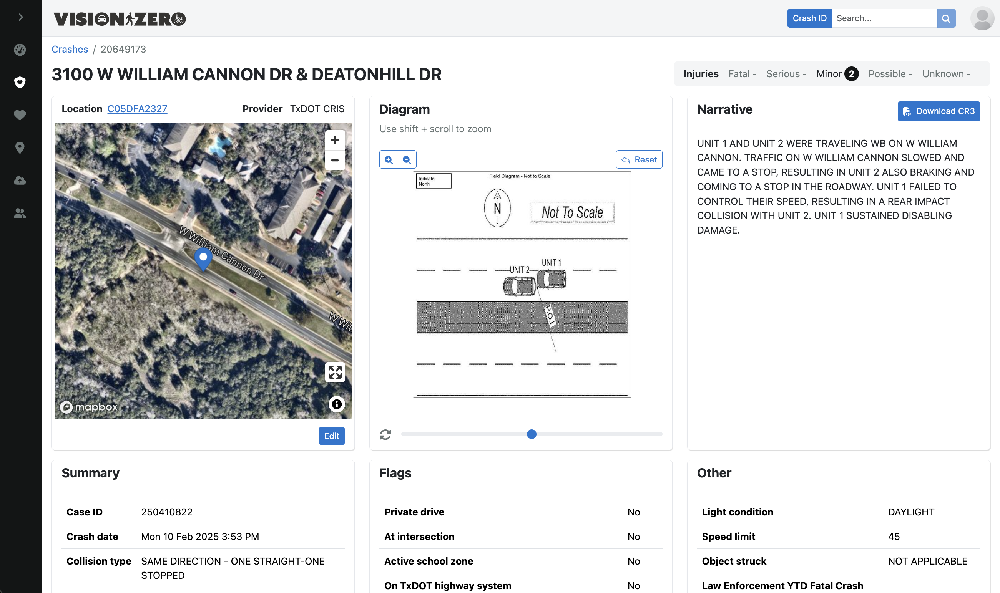

# Vision Zero Editor (VZE)



The Vision Zero Editor (VZE) enables City of Austin staff to view and edit traffic crash records. It's the central application that supports the City's [Vision Zero program](https://www.austintexas.gov/department/vision-zero) and related safety efforts carried out by the Transportation & Public Works Department.

- Production: https://visionzero.austin.gov/editor
- Staging: https://visionzero-staging.austinmobility.io/editor

## Quick start

1. Configure the environment. Create a file called `.env.local`  here, in the root of the `/editor` subdirectory. Save the contents of the 1Password item called **Vision Zero Editor (VZE) Environment File** into this file.

2. Activate your Node environment - requires [`nvm`](https://github.com/nvm-sh/nvm).

```shell
nvm use
```

3. Install required packages

```shell
npm install
```

4. Finally, start the app 

```
npm run dev
```

Visit [http://localhost:3002](http://localhost:3002) with your browser to see the result

## Deployment

Production and staging instances are deployed on Netlify automatically whenever commits are merged to `production` or `main`, respectively. 

Netlify deploy previews are automatically deployed for any pull request opened against `main`. 

We also maintain a separate Auth0 application for both production and staging.
