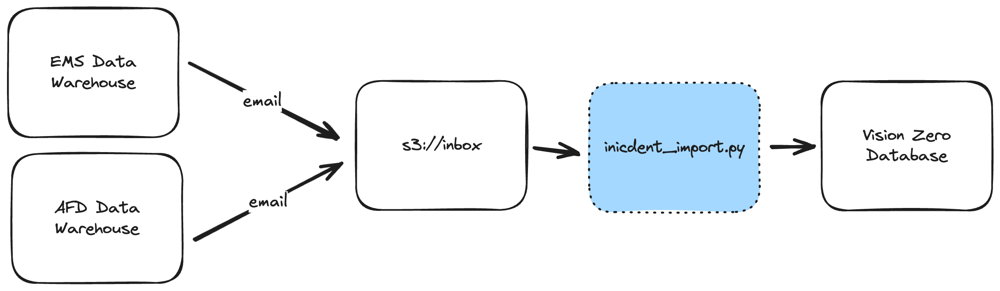

# EMS and AFD Incident Import ETL

This ETL manages the processing and importing of Emergency Medical Services (EMS) and Austin Fire Department (AFD) data into the Vision Zero database.

A single script, `incident_import.py`, is equipped to handle both data sources, although they differ in structure and file type.

## Data flow



Both data sources are delivered to an AWS S3 bucket via a Simple Email Service configuration, and are received in `s3://atd-vision-zero/<env>/<source>_incidents/inbox`.

 When the script runs, it processes each file in the `/inbox` and moves the processed file to the `/archived` directory upon completion.

See [this gitbook page](https://app.gitbook.com/o/-LzDQOVGhTudbKRDGpUA/s/-M4Ve3sp7qA5cPXha0B4/external-data-sources) for more details about the email report delivery and contact info for the report admins.

## Local development

1. Start your local Vision Zero cluster (database + Hasura + editor).

2. Save a copy of the `env_template` file as `.env`, and fill in the details. Make sure to set the `BUCKET_ENV` variable to `dev` in order to safely run the S3 operations locally.

3. Build the docker image using `docker compose`, this is only necessary the first time you run the script, or when updating Python package dependencies.

```shell
docker compose build
```

4. Run the ETL for both `afd` and `ems` souces. The `docker compose` invocation will mount your local copy of the ETL and environment into the Docker container

```
$ docker compose run import afd --skip-archive
$ docker compose run import ems --skip-archive
```

Note that the `--skip-archive` directive prevents the script from moving each processed file to the `/archive` directory. This option is for local development and should not be used in production.

## Deployment + CI

A github action is configured to build and push this ETL's image to the Docker hub whenever files in this directory are changed.

The ETL itself is deployed via [atd-airflow](https://github.com/cityofaustin/atd-airflow).
