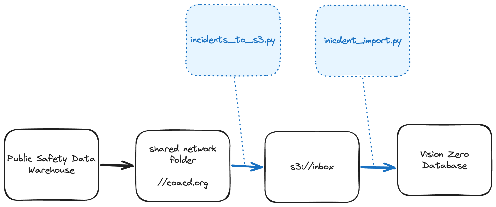

# CAD Incident Import ETL

This ETL manages the processing and importing of Computer Aided Distpatch (CAD) data into the Vision Zero database.

## Data flow



todo 

- See Slack convo about the COACD shared directory https://austininnovation.slack.com/archives/CM9MK950S/p1776089399146099?thread_ts=1775856610.778289&cid=CM9MK950S

## Local development

1. Start your local Vision Zero cluster (database + Hasura + editor).

2. Save a copy of the `env_template` file as `.env`, and fill in the details. Make sure to set the `BUCKET_ENV` variable to `dev` in order to safely run the S3 operations locally.

3. Build the docker image using `docker compose`, this is only necessary the first time you run the script, or when updating Python package dependencies.

```shell
docker compose build
```

4. Run with the local override to set a local mount point

```shell
docker compose -f docker-compose.yml -f docker-compose.local.yml run import
``

Note that the `--skip-archive` directive prevents the script from moving each processed file to the `/archive` directory. This option is for local development and should not be used in production.

## Questions

- Incident type
- Incident group
- Field for how the call was dispatched (911 call, other agency referral, officer-initiated...)
- seem to be missing some crash types for APD

## Deployment + CI

TODO

A github action is configured to build and push this ETL's image to the Docker hub whenever files in this directory are changed.

The ETL itself is deployed via [atd-airflow](https://github.com/cityofaustin/atd-airflow).
