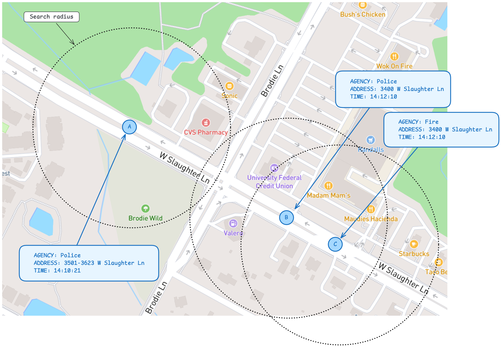

# CAD Incident Import ETL

This ETL manages the processing and importing of Computer Aided Dispatch (CAD) data into the Vision Zero database.

## Background

These records contain information on 911 calls and officer-initiated incidents related to traffic crashes as recorded in the Austin public safety Computer Aided Dispatch (CAD) system. They are referred to colloquially as "CAD calls".

Data is provided by the public safety enterprise data team and has been reviewed and approved by subject matter experts at the Austin Fire Department, Austin Police Department, and Austin-Travis County EMS.

## Data flow


This data is sourced from the public safety data warehouse, which is maintained by the Austin Technology Services department (ATS). They have configured two views for us which are exported to a shared COACD network folder on a daily basis.

Data is imported into our database via a two step process:

- `incidents_to_s3.py`: Copies daily extract files from the shared network drive to AWS S3
- `incidents_import.py`: Loads the daily extract files into the Vision Zero database

This shared network drive is mounted to our on-prem ETL server at `/mnt/vision_zero_cad`, and the scripts in this repo can be configured to use that mount path or a local file as needed (see **Local Development**).

Once data has been imported, a third script, `incident_linker.py` is used to group incidents based on their time and location.

## Daily extract files

We process two distinct files on a daily basis:

- The CAD incident file, in which each row is a crash-related CAD incident responded to by AFD, EMS, or APD. Sample filename: `TPWCADTrafficSafetyDaily_20260410.CSV`

- The incident group file, which provides metadata about incident group relationships. The incident group file is not well understood, but should be helpful in the future as we try to link CAD records to the same crash incident response. Sample filename: `PWCADTrafficSafetyDaily_20260410.CSV`.

Each daily file contains the five previous days of records up to the moment the file is generated. Files are processed as upserts, as records may be updated in the intervening days by the CAD system.

## Local development

1. Save a copy of the `env_template` file as `.env`, and fill in the details. Make sure to set the `BUCKET_ENV` variable to `dev` in order to safely run the S3 operations locally.

2. Start your local Vision Zero cluster (database + Hasura + editor).

3. Build the docker image using `docker compose`, this is only necessary the first time you run the script, or when updating Python package dependencies.

```shell
docker compose build
```

4. In order to emulate the network volume mount on the prod server, you'll run locally with an extra docker compose file that mounts at `/mnt/vision_zero_cad` and also mounts your local copy of the repo into the `/app` directory.

### `incidents_to_s3.py`

This script will load files from your local machine to the S3 inbox. You can acquire test files by downloading them from AWS S3. Navigate to [`atd-vision-zero/dev/cad_incidents/archive`](https://us-east-1.console.aws.amazon.com/s3/buckets/atd-vision-zero?region=us-east-1&prefix=dev/cad_incidents/archive/) and download a handful of the files from this archive directory, saving them to the `./test_data` directory in this repo.

To run the script, make use of the `docker-compose.local.yml` override file to mount the `./test_data` directory into the container's `/mnt` point.

```shell
docker compose -f docker-compose.yml -f docker-compose.local.yml run import incidents_to_s3.py
```

- `--dry-run`: Log what would be uploaded and deleted without actually doing it
- `--remove`: Delete the file(s) from the file system processing

### `incidents_import.py`

Use `incidents_import.py` to download, transform, and load the files from the S3 inbox into the Vision Zero database via the Hasura API

```shell
docker compose -f docker-compose.yml -f docker-compose.local.yml run import incidents_import.py
```

- `--dry-run`: Log what would be downloaded and processed without actually doing it
- `--archive`: Move each processed file to the S3 bucket's `/archive` directory
- `--local-files`: Process files from local `COACD_MOUNT_PATH` directory instead of AWS S3

### `incident_linker.py`

This script is responsible for creating and linking crash-related records to [Vision Zero Incidents](../../database/README.md#vision-zero-incidents).

A single real-world crash is often seen by multiple public-safety systems — an APD crash report, one or more CAD calls, an EMS patient record, an AFD response — each recorded in its own table. `incident_linker.py` groups these disparate records under a shared `vz_incidents` record so that downstream consumers can reason about the complete response to a single event.

The script processes one record type per run (`cad`, `crashes`, `ems`, or `afd`), reading from `vz_incident_records_view` — a unified view that exposes all four source tables under a common schema (record_id, record_incident_number, record_responding_agency, record_timestamp, geom, etc.). 

Only records older than 24 hours are considered, to ensure they've had time to be fully populated upstream before matching.

For each unprocessed record, the script attempts to link it to an existing VZ incident using two strategies, in order:

1 **Incident-number match**. When the record carries a shared identifier that another system uses for the same event, the script matches on that number. The valid edges are: crashes ↔ CAD (on `case_id` / `master_incident_number`), EMS ↔ CAD, and AFD ↔ CAD. 
This is the most reliable signal, since a shared incident number is a near-certain indication of the same real-world event.

1. **Geo-temporal proximity**. If no incident-number match is found (or none is possible for this record), the script searches `vz_incident_records_view` for any already-linked record within 500 meters and 60 minutes. If exactly one VZ incident matches, the record links to it; if more than one matches, the record is left for manual QA with its candidate IDs preserved.

If neither strategy produces a match, the script creates a new `vz_incidents` record and links the current record to it.

**A note on crash–CAD matching and agency coverage**. Crash reports arrive from every law-enforcement agency operating in the tri-county area, but CAD data exists only for the City of Austin's responders (APD, AFD, EMS). A crash can therefore only have a CAD counterpart when APD was the responding agency. The script encodes this by skipping incident-number matching for any crash where `record_responding_agency` is not `apd`. 

The outcome of each record's matching attempt is written back to the source table's `vz_incident_match_status` column.
docker compose -f docker-compose.yml -f docker-compose.local.yml run import incident_linker.py afd  --limit 1000



## Production run

In production, ensure the env var for `BUCKET_ENV` is set to `prod`, and the
`HASURA_GRAPHQL_ENDPOINT` and `HASURA_GRAPHQL_ADMIN_SECRET` are set to the production endpoint.

Scripts should be run with the `--remove` and `--archive` options to prevent future reprocessing.

```shell
python incidents_to_s3.py --remove
```

```shell
python incidents_import.py --archive
```

```shell
python incident_linker.py crashes
```

## Deployment + CI

A github action is configured to build and push this ETL's image (`atddocker/vz-cad-incidents-import`) to Docker hub whenever files in this directory are changed.

The ETL itself is deployed via [atd-airflow](https://github.com/cityofaustin/atd-airflow).
