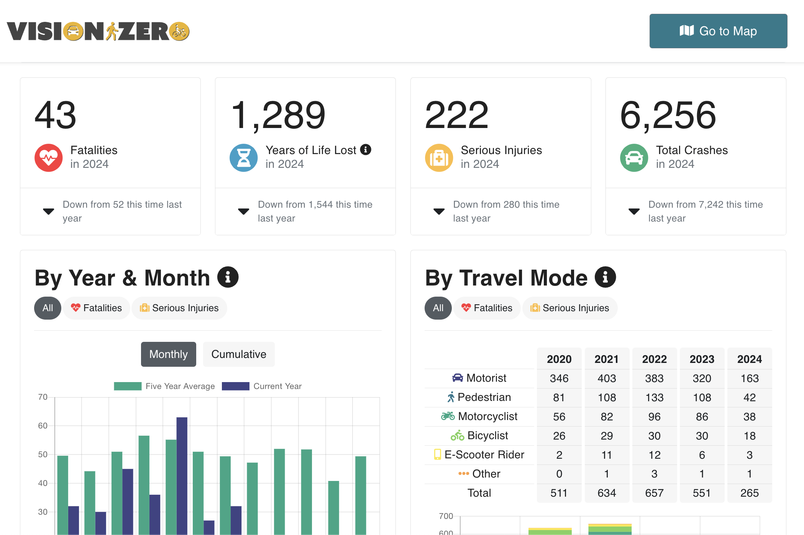

# Vision Zero Viewer (VZV)



The Vision Zero Viewer is a public-facing interactive web app showing crash data related to Vision Zero. Users can view crash data by different categories, including transportation mode, demographic groups impacted, time of day, and location.

- Production site: https://visionzero.austin.gov/viewer/
- Staging site: https://visionzero-staging.austinmobility.io/viewer/

Crash data is sourced from TxDOT's Crash Records Information System (CRIS) database. [Vision Zero Editor](https://github.com/cityofaustin/vision-zero/tree/production/editor) provides tools for City of Austin Transportation Department staff to enrich crash data with additional attributes, as well as correct any erroneous or missing data.

For resources and updates, see the [Vision Zero Crash Data System](https://github.com/cityofaustin/atd-data-tech/issues/255) project index.

See our Socrata open datasets for [crash](https://data.austintexas.gov/Transportation-and-Mobility/Vision-Zero-Crash-Report-Data/y2wy-tgr5/data) and [demographics](https://data.austintexas.gov/Transportation-and-Mobility/Vision-Zero-Demographic-Statistics/xecs-rpy9) data.

## Getting started

Create your environment file by saving a copy the `env_template` file as `.env.local`. The values for this file can be found in 1password under **Vision Zero Viewer (VZV) Environment File**

We use [Node Version Manager](https://github.com/nvm-sh/nvm) (nvm) to keep our `node` versions in sync with our environments. With `nvm` installed, run `nvm use` from this directory to activate the current `node` and `npm` version required for this project. If you don't want to use `nvm`, refer to the `.nvmrc` file for the `node` version you should install.

Install dependencies:

`npm install`

Run development server:

`npm run dev`

Create a production build - The build output will be in the build/ directory:

`npm run build`

Locally preview the production build:

`npm run preview`

### ESLint

We use ESLint with ESLint 9 flat config to catch code issues. Run the linter:

```
npm run lint        # Check for issues
npm run lint:fix    # Automatically fix what's possible
```

### Prettier

In development, this project uses [Prettier](https://prettier.io/) for code formatting which is set in .prettierrc.

Visit link for installation or install the [extension for VSCode](https://marketplace.visualstudio.com/items?itemName=esbenp.prettier-vscode) and enable "Format on Save" for automatic formatting

Command line:

```
npm run format           # Format all source files
npm run format:check     # Check formatting without modifying files
```
